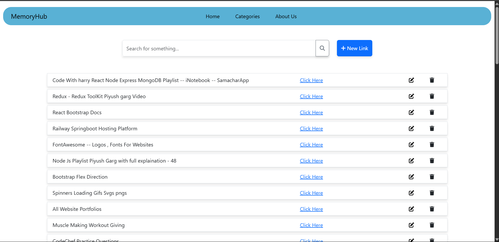
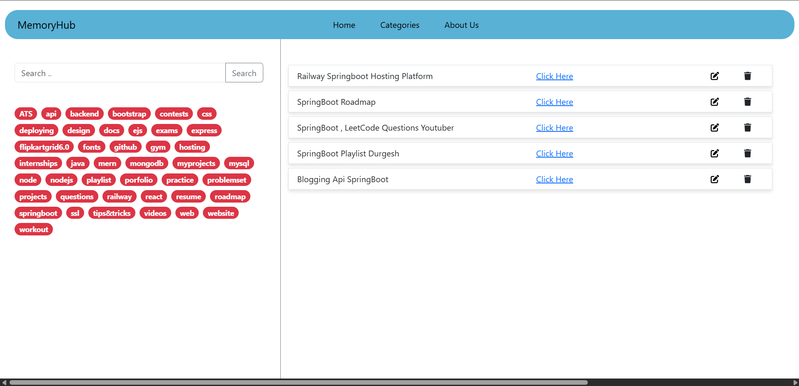
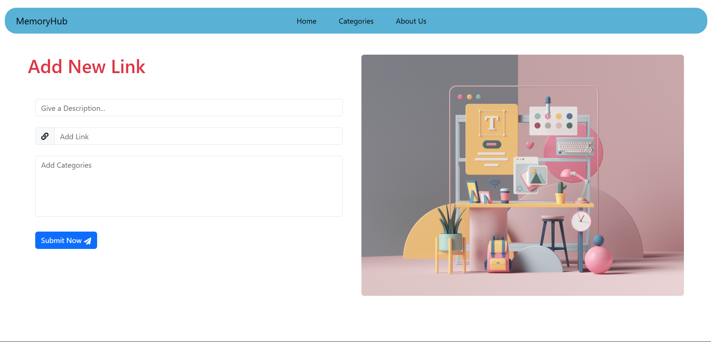

# MemoryHub

 

MemoryHub is a web platform that lets users save important links, organize them with tags, and easily search by title, category, or tags. It offers a user-friendly interface for efficient link management.


---

## **📌 Table of Contents**  
1. [Features](#-features)  
2. [Technologies Used](#-technologies-used)  
3. [Folder Structure](#-folder-structure)  
4. [Installation & Setup](#-installation--setup)  
5. [Screenshots](#-screenshots)  
6. [API Documentation](#-api-documentation)  
7. [Contributing](#-contributing)   
8. [Contact](#-contact)  

---
## ✨ Features

- 📌 Save and organize web links with custom tags
- 🔍 Powerful search by title, category, or tags
- � User-friendly interface with responsive design
- 🔄 Real-time updates and synchronization
- 🗂️ Categorize links for better organization
- 🚀 Quick access to frequently used links

---
## 🛠 Technologies Used

### Frontend
- React.js
- Redux Toolkit (State management)
- React Router (Navigation)
- React Bootstrap (UI Components)
- Axios (HTTP requests)
- Styled Components (CSS-in-JS)

### Backend
- Node.js
- Express.js
- MongoDB (via Mongoose)
- RESTful API architecture

---
## 📂 Folder Structure 

```
jasjeev013-memoryhub/
├── README.md
├── package.json
├── backend/
│   ├── db.js
│   ├── index.js
│   ├── package-lock.json
│   ├── package.json
│   ├── vercel.json
│   ├── .env
│   ├── models/
│   │   └── Item.js
│   └── routes/
│       └── items.js
├── public/
│   ├── index.html
│   ├── manifest.json
│   └── robots.txt
└── src/
    ├── AboutUs.jsx
    ├── App.css
    ├── App.js
    ├── App.test.js
    ├── data.json
    ├── index.css
    ├── index.js
    ├── reportWebVitals.js
    ├── setupTests.js
    ├── components/
    │   ├── AddLink.jsx
    │   ├── Categories.jsx
    │   ├── Home.jsx
    │   ├── LinkItem.jsx
    │   ├── NavBar.jsx
    │   ├── Spinner.jsx
    │   ├── Toast.jsx
    │   └── UpdateLink.jsx
    └── redux/
        ├── store.js
        └── slices/
            ├── categorySlice.js
            ├── searchSlice.js
            └── toastSlice.js
```

---
## ⚙ Installation & Setup

### Prerequisites
- Node.js (v16 or higher)
- MongoDB (either local or Atlas URI)
- npm (comes with Node.js)

### Setup Instructions

1. **Clone the repository**
   ```bash
   git clone https://github.com/jasjeev013/memoryhub.git
   cd memoryhub
   ```

2. **Install frontend dependencies**
   ```bash
   npm install
   ```

3. **Install backend dependencies**
   ```bash
   cd backend
   npm install
   cd ..
   ```

4. **Environment Setup**
   - Create a `.env` file in the `backend` directory with:
     ```
     MONGO_URI=your_mongodb_connection_string
     PORT=5000
     ```

5. **Running the Application**
   - For development (both frontend and backend):
     ```bash
     npm run both
     ```
   - Alternatively, run separately:
     - Frontend:
       ```bash
       npm start
       ```
     - Backend (in another terminal):
       ```bash
       cd backend
       nodemon index.js
       ```

---

## 📸 Screenshots

### **Dasdboard Page**
  
### **Category Dashboard**  
  
### **Adding LinK**  
  

---
## 📜 API Documentation

| Method | Endpoint       | Description                     |
|--------|----------------|---------------------------------|
| GET    | /api/items     | Get all saved links             |
| POST   | /api/items     | Add a new link                  |
| PUT    | /api/items/:id | Update an existing link         |
| DELETE | /api/items/:id | Delete a link                   |
| GET    | /api/items/:id | Get a specific link             |

---
## 🤝 Contributing

Contributions are welcome! Please follow these steps:
1. Fork the repository
2. Create your feature branch (`git checkout -b feature/AmazingFeature`)
3. Commit your changes (`git commit -m 'Add some AmazingFeature'`)
4. Push to the branch (`git push origin feature/AmazingFeature`)
5. Open a Pull Request

---

## 📧 Contact

Created by [Jasjeev Singh](https://github.com/jasjeev013) - feel free to contact me!

---
